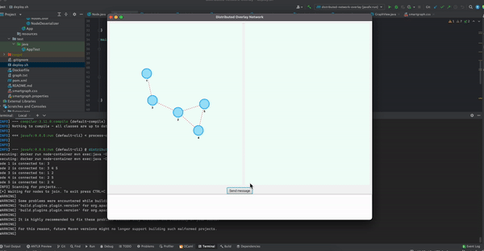

## Deploy and run
./deploy.sh


## Nodes
Each node is functioning as a separate instance, representing a distinct machine. In our simulation, we will invoke each node with arguments. The first argument specifies the node number, for instance, '1,' and the subsequent arguments represent its physical connections, such as '2' and '3,' indicating that in the real world, node '1' is connected to nodes '2' and '3'. For example, here's how to run a node
```
java Node 1 2 3
```
## System
Each time a node is invoked, it will send a join request to a RabbitMQ where the creation of the overlay graph will take place. RabbitMQ is responsible for routing messages and not for message decoding. Whenever a message is received on the broker, it is sent out to other nodes, which then handle the message.

If a node understands that the received message is from a node with a direct physical connection, it will add their routing as a possible route for itself. Additionally, it will also incorporate their routing into its knowledge. For node visibility, the maximum hop distance is set to 2, meaning it can only see up to its neighbor's neighbor.

When sending a message, the first step is to check if the destination is known. If not, the message will be sent to the closest node in the visibility forest to forward this message.
